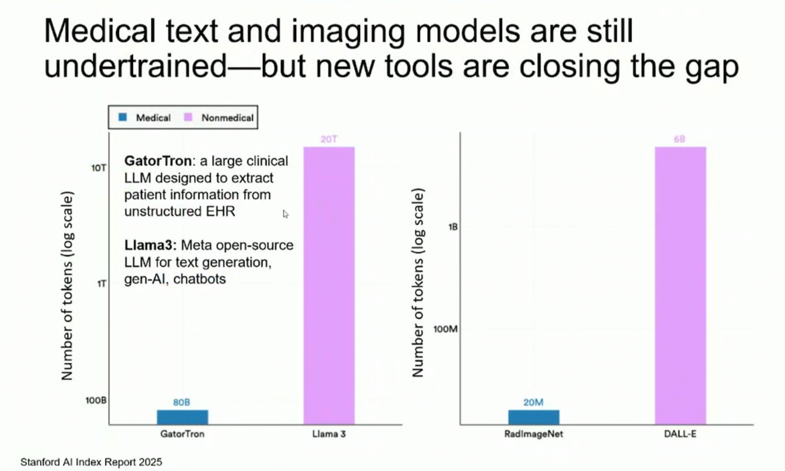

# AI and digital health track at ESMO 2025
K. Porkka 22-OCT-2025

Short notes, copies of selected slides, video captures of presentations. Feel free to add comments, links etc.

See also AI-driven biomarker [presentations](https://dailyreporter.esmo.org/esmo-congress-2025/ai-digital-oncology/new-artificial-intelligence-based-biomarkers-offer-early-insight-into-treatment-response?utm_source=newsletter&utm_medium=email&utm_campaign=ESMO-WW-COM-Members-Delegates-ESMO25-email-newsletter-20251021-64785).

[TOC]

## <u>Session: AI in clinical trials</u>

Saturday, 18 October 2025

### AI-based procedures to augment clinical trials (A. Prelaj)

Arsela Prelaj (Milan, Italy)

Tools discussed: TrialMAtchAI, PyTrials, MedMatch, Trial Pathfinder (Nature), TrialTranslator (Nat Med - Flatiron)

Synthetic control arm RCTs. Pragmatic clin trials - AI helps to design

**Silent clinical trials** - key future AI-implementation tool, see eg. https://www.nature.com/articles/s41746-025-01674-3

[Link to presentation video](https://drive.google.com/file/d/13be2C6e2FC5VLtLaZ4zAuMkaOsueXx2u/view?usp=sharing) 

### AI for genomic precision medicine in clinical trials (M. Aldea)

Mihaela Aldea (Villejuif, France)

### Digital infrastructure for clinical trials (I. Vaz-Luis)

Ines Vaz-Luis (Villejuif, France)

[Link to presentation video](https://drive.google.com/file/d/135V8YkFwUD_OnDga9Lrj9BEZEt3wcaEc/view?usp=drive_link) 

### AI-based drug discovery for oncology (C. Curtis)
Christina Curtis (Stanford, United States of America)

A fantastic, visionary presentation

[Link to presentation video](https://drive.google.com/file/d/17kcNd6TsH4WnvAS8oVr24yRStU-Iot0m/view?usp=drive_link)

Papers referenced:

[Hallmarks_of_AI.pdf](files/Hallmarks_of_AI.pdf) 

Key slides:

 ## <u>Session: Advancing cancer care through AI and real-world evidence: Opportunities and challenges for patient advocacy</u>

Saturday, 18 October 2025

### Transforming RWE with AI: The future of data-driven cancer care (L. Verlingue)
Loic Verlingue (Lyon, France)

[Link to presentation video](https://drive.google.com/file/d/1ZUDeFByrVQhJTZXkgSUSJkhp8omjoPAY/view?usp=drive_link)

### AI and RWE: Addressing healthcare disparities and improving access (A. Prelaj)

Arsela Prelaj (Milan, Italy)

[Link to presentation video](https://drive.google.com/file/d/1jic05FqInrBGWu_HxFrz-uFwTWA1qNUq/view?usp=drive_link)

### AI and real-world evidence: The patient advocate experience (G. van Oortmerssen)

Gerard van Oortmerssen (Naarden, Netherlands)

[Link to presentation video](https://drive.google.com/file/d/1Ep4AQwEvFqqP3AMJxbRgRJgWMTEUQS0T/view?usp=drive_link)

### How AI can help detect health risks early in breast cancer survivors: Real-world benefits from the ARTILLERY project (N. Harbeck)

Nadia Harbeck (Munich, Germany)

[Link to presentation video](https://drive.google.com/file/d/1suSs30kiiDuR_hXrlMBPQKjzOTJTDGM0/view?usp=drive_link)

## <u>Session: Chat GPT and cancer care</u>

### Large language models and AI agents in oncology - a primer (J. Kather)

*Jakob Nikolas Kather (Dresden, Germany)*

Major issue: AI-results not validated, how should that be done at scale?

Nice overview, update to his EHA2025 presentation

Paper referenced:   [Ferber_Nature_Cancer_2025.pdf](files/Ferber_Nature_Cancer_2025.pdf) 

[Link to presentation video](https://drive.google.com/file/d/16FxEsZvEhnYH2N-cqzjNUXdJNCQ_xs-C/view?usp=drive_link)

### Lessons learned from implementing LLMs in a cancer centre (M. Aldea)

*Mihaela Aldea (France)*

10 000 lung cancer patients as a pilot, nation-wide data collection (small and large centers). Central harmonization, stored in a RedCap db, in their own data model

Opt-out process, 0,3% opted out! Number went down by refining the patient information to a more patient-friendly (using chapGPT!)

Prospective LLM trial on cancer ongoing in France

[Link to presentation video](https://drive.google.com/file/d/16xfsynD3rKgdSqL4T5i3lZ0wNJQ3683Z/view?usp=drive_link)

### Large language models for drug development and cancer therapy (L. Verlingue)

Loic Verlingue (Lyon, France)

Preprint of a single-cell foundation model  just published: https://www.biorxiv.org/content/10.1101/2025.04.14.648850v2 

[Link to presentation video](https://drive.google.com/file/d/13ncQ7ABzTWlMe21NEtWm3r29fEhuBJmO/view?usp=drive_link)

### Agentic AI in oncology (D. Truhn)

Daniel Truhn (Aachen, Germany)

[Link to presentation video](https://drive.google.com/file/d/1_UNZMv6x31ud-yZ5FwUEo-5jkF42AGdR/view?usp=drive_link)

## <u>Proffered paper session: AI & digital oncology</u>

Monday, 20 October 2025

### Pan cancer biomarkers for immunotherapy response: A pooled analysis of neoadjuvant trials (P. Tan)
Pedro Tan (Amsterdam, Netherlands)

Paper referenced:  [Tan_Nature_2025.pdf](files/Tan_Nature_2025.pdf) 

[Link to presentation video](https://drive.google.com/file/d/1HpfgDMcPK9UMGQzvXcE0cQeZqnbCKmJr/view?usp=drive_link)

### Prognostic value of the combined analysis of pathologists and artificial intelligence (CAPAI) in high-risk stage II-III colon cancer treated without chemotherapy: Interim report from a nationwide validation (M-C. Bakker)

Marie-Christine Bakker (Utrecht, Netherlands)

[Link to presentation video](https://drive.google.com/file/d/1DTvY7nv9W8RotCx6JLuM-WwCRtzVNzK3/view?usp=drive_link)

### External validation of AI for early-stage lung cancer recurrence prognosis using CT radiomics (A. Valter)

Ann Valter (Tallinn, Estonia)

[Link to presentation video](https://drive.google.com/file/d/1xXCLONIKeiGaqn8qCnhrIsQmioKJZ2Sp/view?usp=drive_link)

### Invited Discussant (A. Prelaj)

Arsela Prelaj (Milan, Italy)

[Link to presentation video](https://drive.google.com/file/d/19IaoSOuVzynocomfjPZhLFSug1PRWE_j/view?usp=drive_link)

### AI-generated synthetic cohorts for accelerated clinical trial design and collaboration: Data from 19,000 patients (Pts) with metastatic breast cancer (MBC)(E. Saad)

Eddy Saad (Boston, United States of America)

[Link to presentation video](https://drive.google.com/file/d/1yqTIm9ZkgZRGEpWX6zrnDaxwd7LGHkv-/view?usp=drive_link)

### IMPRESS-Norway: A nationwide precision-oncology study for off-label targeted therapies - Results from the first 1,740 patients (S. Brabrand)

Sigmund Brabrand (Oslo, Norway)

[Link to presentation video](https://drive.google.com/file/d/1UOSCrM93kDlTVAs65nEoDXgQTaeGY3Mh/view?usp=drive_link)

### Invited Discussant (J. Vibert)
Julien Vibert (Villejuif, France)

[Link to presentation video](https://drive.google.com/file/d/11EyVAcYBQZvdCKHluil2VsGmS-s5F8aQ/view?usp=drive_link)

